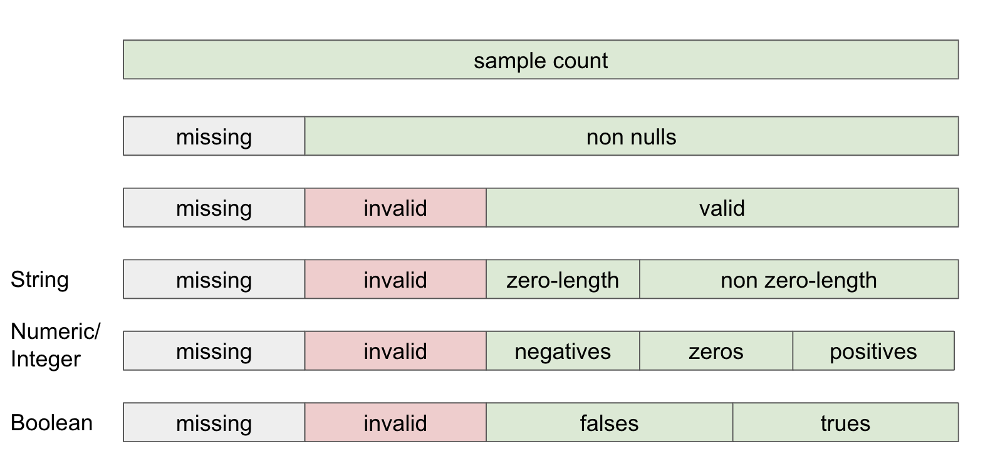
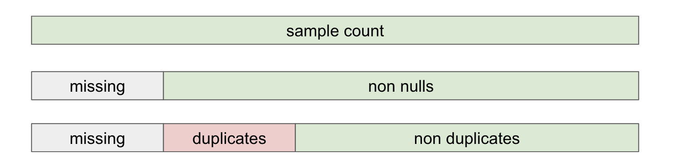

# Supported Metrics

# Table Metrics

| Metric | Description | Field | Since |
| --- | --- | --- | --- |
| Row count | Number of rows in this table | `row_count` |  |
| Column count | Number of columns in this table | `col_count` |  |

# Column Metrics

### Schema

| Metric | Description | Column Type | Filed | Since |
| --- | --- | --- | --- | --- |
| Schema Type | The column type defined in data source | All types | `schema_type` |  |
| Generic type | A generic type of schema type. It can be `string`, `integer`, `numeric`, `datetime`, `boolean`, `other` | All types | `type` |  |

### Data Composition

Describe the composition of the data in one column. 

| Metric | Description | Column Type | Field | Since |
| --- | --- | --- | --- | --- |
| Missing count | The count of null values. | All types | `nulls` | 0.6.0 |
| Non null count | The count of non-null values. | All types | `non_nulls` |  |
| Invalid count | The count of values that does not match the schema type. For example, a string in a numeric column. It only happen in sqlite | All types | `invalids` | 0.6.0 |
| Valid count | The count of non-null minus invalid values | All types | `valids` | 0.6.0 |
| Zero count | The count of zero values | integer, numeric | `zeros` | 0.6.0 |
| Negative value count | The count of negative values | integer, numeric | `negatives` | 0.6.0 |
| Positive value count | The count of positive values | integer, numeric | `positives` | 0.6.0 |
| Zero length string count | The count of  empty strings | string | `zero_length` | 0.6.0 |
| Non zero length string count | The count of non empty strings | string | `non_zero_length` | 0.6.0 |
| True count | The count of true values | boolean | `trues` | 0.6.0 |
| False count | The count of false values | boolean | `falses` | 0.6.0 |

### General Statistic

The general statistic of a column

| Metric | Description | Column Type | Field | Since |
| --- | --- | --- | --- | --- |
| Min | The value of  the minimum item | integer, numeric, datetime | `min` |  |
| Max | The value of the maximum item | integer, numeric, datetime | `max` |  |
| Average | The average of a column. | integer, numeric | `avg` |  |
| Sum | The sum of a column. | integer, numeric | `sum` |  |
| Standard deviation | The standard deviation of a column. | integer, numeric, | `stddev` | 0.4.0 |

### Text Length Statistic

The text length statistic of a column.

| Metric | Description | Column Type | Field | Since |
| --- | --- | --- | --- | --- |
| Min length | The minimum text length of a string column | string | `min` | 0.6.0 |
| Max length | The maximum text length of a string column | string | `max` | 0.6.0 |
| Average length | The average text length of a string column | string | `avg` | 0.6.0 |
| Std. Deviation of length | The standard deviation text length of a string column | string | `stddev` | 0.6.0 |

### Uniqueness

Analyze the uniqueness of a column

- Distinct: Count of distinct items
- Duplicates: Count of recurring items

For example, if a dataset is `(NULL, a, a, b, b, c, d, e)`

- Distinct = 5, `(a, b, c, d, e)`
- Duplicates = 4, `(a, a, b, b)`
- Non-duplicates = 3, `(c, d, e)`
- Missing = 1

The total number = missing + duplicates + non-duplicates

| Metric | Description | Column Type | Field | Since |
| --- | --- | --- | --- | --- |
| Distinct | Count of distinct items | integer, string, datetime,  | `distinct` |  |
| Duplicates | Count of recurring items | integer, numeric, string, datetime | `duplicates` | 0.6.0 |
| Non duplicates | Count of non-recurring items | integer, numeric, string, datetime | `non_duplicates` | 0.6.0 |

### Quantiles

Calculate the quantiles of a numeric or integer column

| Metric | Description | Column Type | Field | Since |
| --- | --- | --- | --- | --- |
| min | min, 0th percentile | integer, numeric | `min` |  |
| 5th Percentile | 5th percentile | integer, numeric | `p5` | 0.4.0 |
| 25th Percentile | 25th percentile | integer, numeric | `p25` | 0.4.0 |
| Median | median, 50th percentile | integer, numeric | `p50` | 0.4.0 |
| 75th Percentile | 75th percentile | integer, numeric | `p75` | 0.4.0 |
| 95th Percentile | 95th percentile | integer, numeric | `p95` | 0.4.0 |
| max | max, 100th percentile | integer, numeric | `max` |  |

### Distribution

| Metric | Description | Column Type | Field | Since |
| --- | --- | --- | --- | --- |
| Top K | The top n frequent items and counts | integer, string | `topk` | 0.6.0 |
| histogram | The evenly-split bins. Calculate the counts for each bin. | integer, numeric | `histogram` | 0.6.0 |
| Text length histogram | The evenly-split bins for text length. Calculate the counts for each bin. | string | `histogram` | 0.6.0 |
| Date histogram | The histogram of date, month, or year. Depends on the data min/max range. | datetime | `histogram` | 0.6.0 |
